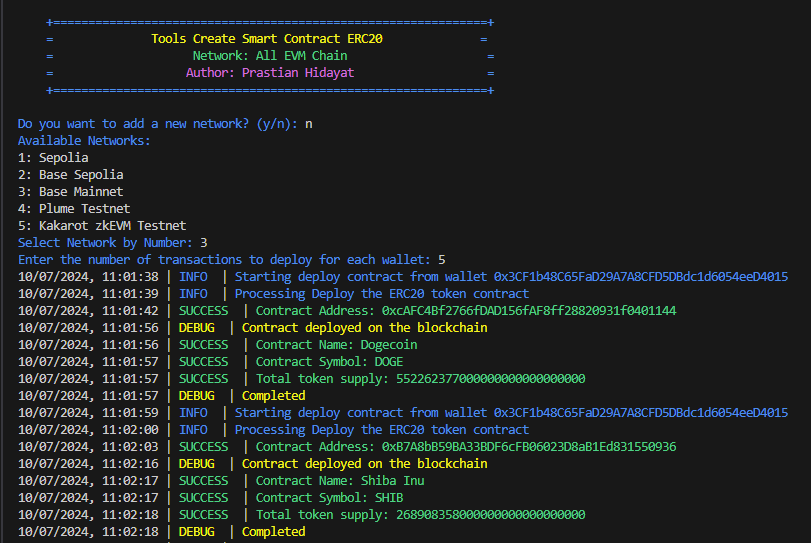

# TOOLS FOR DEPLOYING SMART CONTRACTS

## Deskripsi
Script ini dirancang untuk membuat atau menerapkan smart contract ERC20. Script ini mencerminkan proses pembuatan smart contract di RemixIDE, menyediakan metode yang mudah untuk menerapkan token ERC20 di jaringan yang kompatibel dengan EVM.

## Persiapan
Pastikan Anda sudah menginstal NodeJS. Jika belum, Anda bisa menginstalnya [install disini](https://nodejs.org/en/download/package-manager/current)

## Fitur
- **Fungsionalitas**: Menerapkan Smart Contract ERC20.
- **Dukungan Jaringan**: Kompatibel dengan semua jaringan EVM, termasuk Testnet dan Mainnet. Jika anda ingin menambahkan Jaringan EVM tinggal masukan saja RPC dan CHAIN-ID
- **Dukungan Wallet**: Mendukung beberapa dompet.
- **Pilihan Alat**:
  1. `index.js` untuk data ERC20 yang disesuaikan.
  2. `main.js` untuk data ERC20 acak.

## Instalasi
### Clone Repository
Pertama, clone repository :
```
git clone https://github.com/PrastianHD/smart-contract.git
cd smart-contract
```

### Instal Dependensi
Selanjutnya, instal dependensi yang diperlukan:
```
npm install
```

### Konfigurasi Private Key
Buat file .env di direktori root proyek:
```
PRIVATE_KEY=["your_private_key", "your_private_key"]
```
Ganti `"your_private_key"` dengan kunci pribadi Anda yang sebenarnya.

### Menjalankan Script
### Mode 1: Sesuaikan Token ERC20
Untuk menerapkan smart contract dengan detail token khusus, jalankan:
```
node index.js
```
- Masukan Nama Token
- Masukan Symbol Token
- Masukan Total Supply
  
### Mode 2: Token ERC20 Acak
Untuk menerapkan smart contract dengan detail token yang dihasilkan secara acak
```
node main.js
```
- Masukan Jumlah Transaksi
- Otomatis akan membuat ERC20 dari data token.json

### GIVE ME A START

- Jangan Lupa Klik `STAR` pada reposity ini
- Jangan Lupa `FORK` Reposity ini

